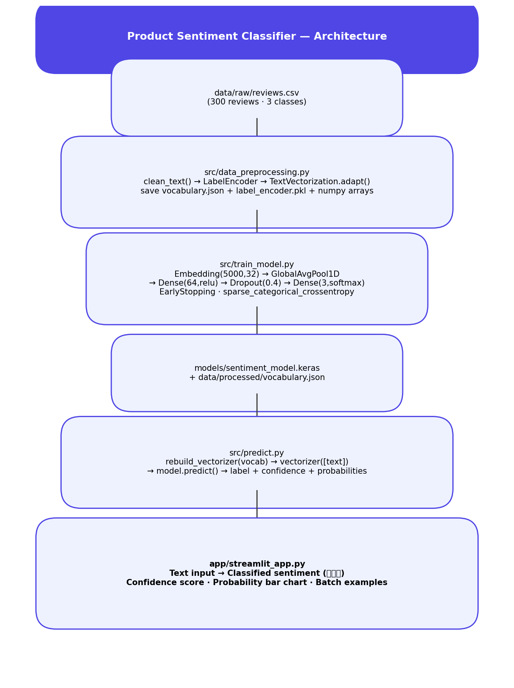
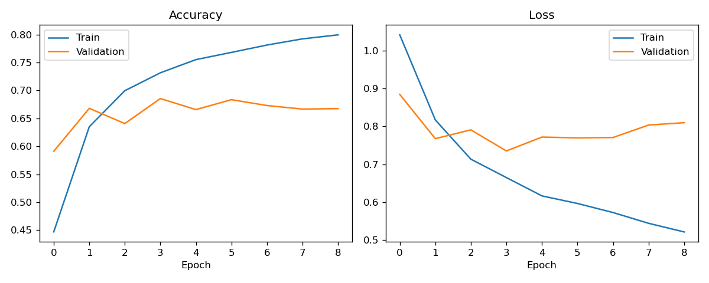
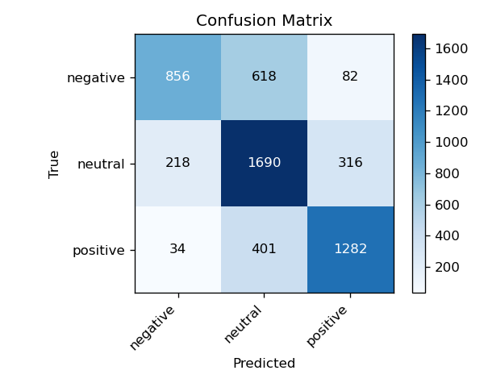

# Product Review Sentiment Classifier

An end-to-end NLP pipeline that classifies product reviews as **Negative**,
**Neutral**, or **Positive** using TensorFlow — deployed as an interactive
Streamlit app.



## Problem Statement

E-commerce platforms and SaaS products receive thousands of reviews daily.
Manually reading them doesn't scale. An automated sentiment classifier routes
negative reviews to support, surfaces positive reviews for marketing, and
provides a real-time pulse on product quality — directly impacting customer
retention and roadmap decisions.

## Dataset Note

This repo now uses a real tweet sentiment dataset stored in `data/raw/`.
The preprocessing script automatically detects the available CSV, normalizes
its columns, and prepares the data for training without manual edits.

## Approach

1. **Preprocessing** (`src/data_preprocessing.py`): clean text, encode labels
   with `LabelEncoder`, stratified 80/20 split, fit `TextVectorization` on
   training text only (saves vocabulary to `vocabulary.json` for portable reloading)
2. **Model** (`src/train_model.py`):
   `Embedding(5000, 32) → GlobalAveragePooling1D → Dense(64) → Dropout(0.4) → Dense(3, softmax)`
   — trained with `EarlyStopping` and `sparse_categorical_crossentropy`
3. **Why not LSTM or BERT?** GlobalAveragePooling on embeddings works well for
   short reviews where word *presence* dominates over word *order*. BERT would
   require pretrained weights download; LSTM adds sequence complexity without
   proportional gain at this text length. Both are documented as clear
   upgrade paths for longer texts or tighter accuracy requirements
4. **Evaluation**: per-class precision/recall/F1, confusion matrix, training curves
5. **Deployment**: Streamlit app with real-time sentiment classification,
   confidence scoring, probability bar chart, and one-click example reviews

## Results (tweet dataset)

| Class    | Precision | Recall | F1   |
|----------|-----------|--------|------|
| Negative | 0.77      | 0.55   | 0.64 |
| Neutral  | 0.62      | 0.76   | 0.69 |
| Positive | 0.76      | 0.75   | 0.75 |




## Project Structure

```
sentiment-classifier/
├── data/
│   ├── raw/train.csv
│   ├── raw/test.csv
│   ├── raw/testdata.manual.2009.06.14.csv
│   ├── raw/training.1600000.processed.noemoticon.csv
│   └── processed/
│       ├── vocabulary.json
│       ├── label_encoder.pkl
│       └── X_train.npy / X_test.npy / y_train.npy / y_test.npy
├── notebooks/eda.ipynb
├── src/
│   ├── data_preprocessing.py
│   ├── train_model.py
│   └── predict.py
├── models/sentiment_model.keras
├── app/streamlit_app.py
├── images/
├── requirements.txt
└── README.md
```

## How to Run

```bash
git clone https://github.com/<your-username>/sentiment-classifier.git
cd sentiment-classifier
pip install -r requirements.txt
python src/data_preprocessing.py
python src/train_model.py
python -m streamlit run app/streamlit_app.py
```

## Troubleshooting

If you see `ModuleNotFoundError: No module named 'tensorflow'`, the active
Python environment does not have this project's dependencies installed.
From the `sentiment-classifier` directory, run:

```bash
pip install -r requirements.txt
```

Then rerun the script or Streamlit app from the same environment.

## Tech Stack

Python · TensorFlow/Keras · Scikit-learn · Pandas · Matplotlib · Streamlit

## Future Improvements

- Fine-tune DistilBERT for context-aware classification on longer reviews
- Add per-review SHAP word-level explanations ("why was this negative?")
- Build a FastAPI endpoint for integration with a review management system
